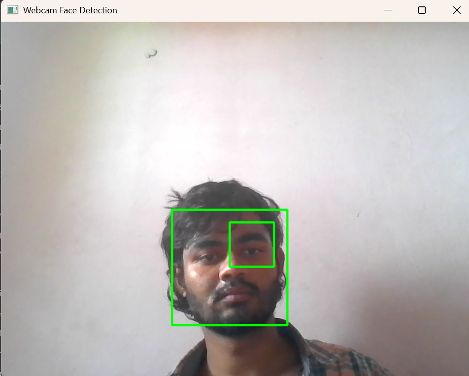

# Face Detection using Webcam

## Project Overview

This project demonstrates real-time face detection using the computer’s webcam and OpenCV’s pre-trained Haar Cascade Classifier.
It continuously captures frames from the webcam, detects faces, and displays them with green rectangles drawn around detected regions.

## Technologies Used

- Python 3.11
- OpenCV (cv2)

## How It Works

1. Loads OpenCV’s built-in haarcascade_frontalface_default.xml classifier.
2. Captures video frames from the webcam in real-time.
3. Converts each frame to grayscale for faster computation.
4. Detects faces using detectMultiScale().
5. Draws rectangles around detected faces and displays the video feed.
6. Stops when the user presses the ‘q’ key.

## Applications

1. Security and surveillance
2. Attendance systems
3. Human–computer interaction

### Pre-processing for face recognition

Installation
Prerequisites

Python 3.11 or later.

Install Required Library
pip install opencv-python

## How to Run

Clone or download this repository.
Navigate to the project folder:

cd project-3

## Run the script:

python webcam_face_detection.py

The webcam window will open and start detecting faces.
Press ‘q’ to exit.

## Project Structure
project-3/
│
├── webcam_face_detection.py   # Main Python script
├── output_face_detection.png  # Output screenshot file (you will capture & save)
└── README.md                  # This file

## Output

The Screeenshot below displays a real-time video feed with green rectangles drawn around detected faces.

